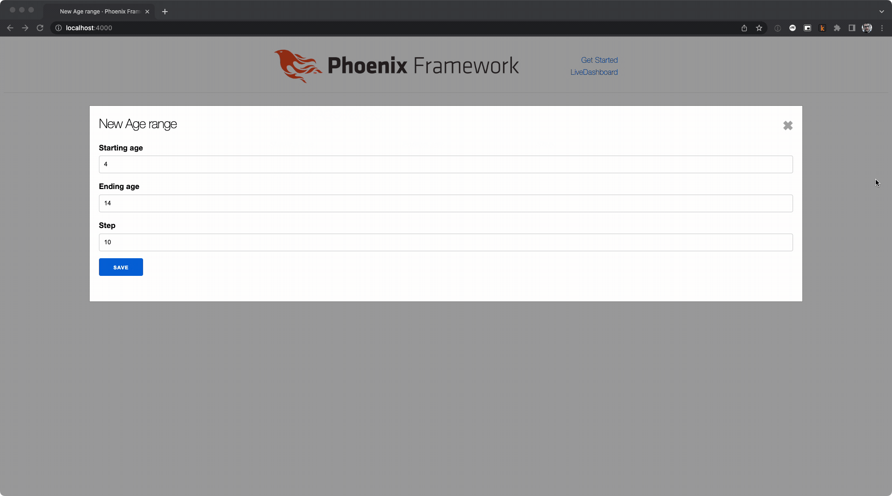

# Phoenix LiveView focus behavior

## Purpose

The purpose of this repo is to illustrate the behavior of Phoenix LiveView when modifying form values from the server side.

When modifying form values that are driven by a changeset, it is possible to modify the value of all form fields **that are not in focus** on the client side from the server side.

### Out of focus elements can be modified

The element that is in focus in the example is `starting_age`. `ending_age` is not in focus and is having its value updated when the `starting_age` is updated.

```elixir
  def handle_event(
        "validate",
        %{"age_range" => %{"starting_age" => starting_age}},
        socket
      ) do
    changeset =
      socket.assigns.age_range
      |> Demo.change_age_range(%{
        # Here' we're modifying the ending_age form element and changes are being accepted.
        starting_age: starting_age |> String.to_integer(),
        ending_age: (starting_age |> String.to_integer()) + 10
      })
      |> Map.put(:action, :validate)

    {:noreply, assign(socket, :changeset, changeset)}
  end
```

Associated code block [here](https://github.com/blakedietz/phoenix-liveview-form-focus/blob/1a6383d251405460202e152d749df624074a6e25/lib/app_web/live/age_range_live/form_component.ex#L41).


### In focus elements cannot be modified

The element that is in focus is the `age_range`. When attempting to modify the `age_range` from the server side, the value is not modified.

Here we try to capture all changes for the step input only. Upon change we attempt to set the step value to 0. Note that it doesn't override the form value on the client side.

```elixir
  def handle_event(
        "validate",
        %{
          "_target" => ["age_range", "step"],
          "age_range" => %{"starting_age" => starting_age}
        },
        socket
      ) do
    changeset =
      socket.assigns.age_range
      |> Demo.change_age_range(%{
        starting_age: starting_age |> String.to_integer(),
        ending_age: (starting_age |> String.to_integer()) + 10,
        # Here we expliclity are trying to set the value to 0, but it does nothing. See
        # images/in-focus.gif.
        step: 0
      })
      |> Map.put(:action, :validate)

    {:noreply, assign(socket, :changeset, changeset)}
  end
```

Associated code block [here](<[true](https://github.com/blakedietz/phoenix-liveview-form-focus/blob/1a6383d251405460202e152d749df624074a6e25/lib/app_web/live/age_range_live/form_component.ex#L16)>).



## Running

To start your Phoenix server:

- Install dependencies with `mix deps.get`
- Create and migrate your database with `mix ecto.setup`
- Start Phoenix endpoint with `mix phx.server` or inside IEx with `iex -S mix phx.server`

Now you can visit [`localhost:4000`](http://localhost:4000) from your browser.

Ready to run in production? Please [check our deployment guides](https://hexdocs.pm/phoenix/deployment.html).

## Learn more

- Official website: https://www.phoenixframework.org/
- Guides: https://hexdocs.pm/phoenix/overview.html
- Docs: https://hexdocs.pm/phoenix
- Forum: https://elixirforum.com/c/phoenix-forum
- Source: https://github.com/phoenixframework/phoenix
