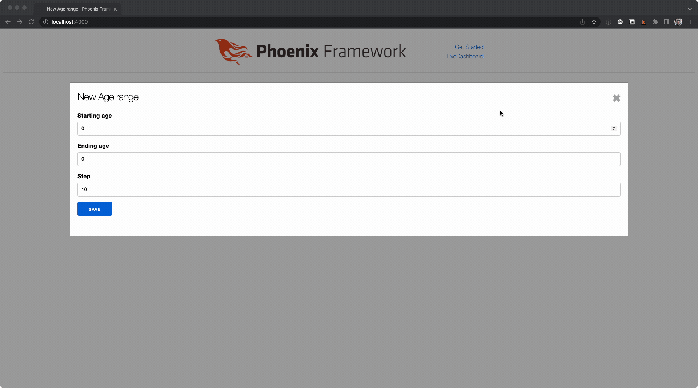

# Phoenix LiveView focus behavior

## Purpose

The purpose of this repo is to illustrate the behavior of Phoenix LiveView when modifying form values from the server side.

When modifying form values that are driven by a changeset, it is possible to modify the value of all form fields **that are note in focus** on the client side from the server side.

### Works

### Does not work

The code that is of interest can be found in `app_web/live/age_range_live/form_component.ex`.
The exact lines of interest are [here](https://github.com/blakedietz/phoenix-liveview-form-focus/blob/a76e70e99b2a948de0d69d617a5d9116369adff8/lib/app_web/live/age_range_live/form_component.ex#L17).

## Running

To start your Phoenix server:

- Install dependencies with `mix deps.get`
- Create and migrate your database with `mix ecto.setup`
- Start Phoenix endpoint with `mix phx.server` or inside IEx with `iex -S mix phx.server`

Now you can visit [`localhost:4000`](http://localhost:4000) from your browser.

Ready to run in production? Please [check our deployment guides](https://hexdocs.pm/phoenix/deployment.html).

## Learn more

- Official website: https://www.phoenixframework.org/
- Guides: https://hexdocs.pm/phoenix/overview.html
- Docs: https://hexdocs.pm/phoenix
- Forum: https://elixirforum.com/c/phoenix-forum
- Source: https://github.com/phoenixframework/phoenix
